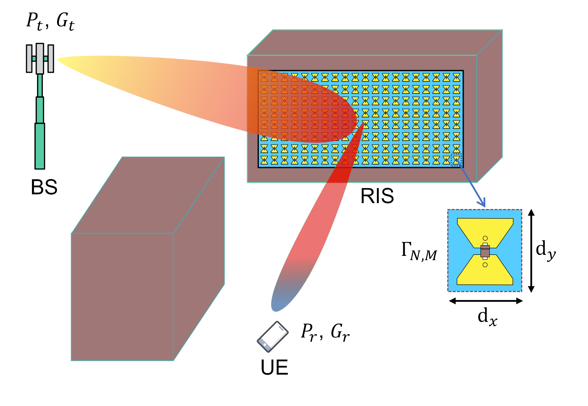

# OpenRIS

Reconfigurable Intelligent Surface project for the WiDeS Group at USC / CSI Group at University of Glasgow. Please direct enquiries to james.rains@glasgow.ac.uk.

# Documentation

- [Datasheet](https://github.com/jimrains/USCRIS/tree/main/datasheet) - general performance information
- [Control interface](https://github.com/jimrains/USCRIS/tree/main/control) - programming information
- [Hardware](https://github.com/jimrains/USCRIS/tree/main/hardware) - details of the digital hardware
- [Publications](https://github.com/jimrains/USCRIS/tree/main/publications) - papers on and involving the USCRIS prototype
- [Measurements](https://github.com/jimrains/USCRIS/tree/main/measurements) - data on far-field pattern measurements and channel sounding

# Documentation To do:
- ~~Access point setup~~
- ~~Socket setup~~
- Python code (interfacing w/ digital pins)
- Hardware outline
- Pinouts
- Altium files
- Component datasheets
- Configuration selection
