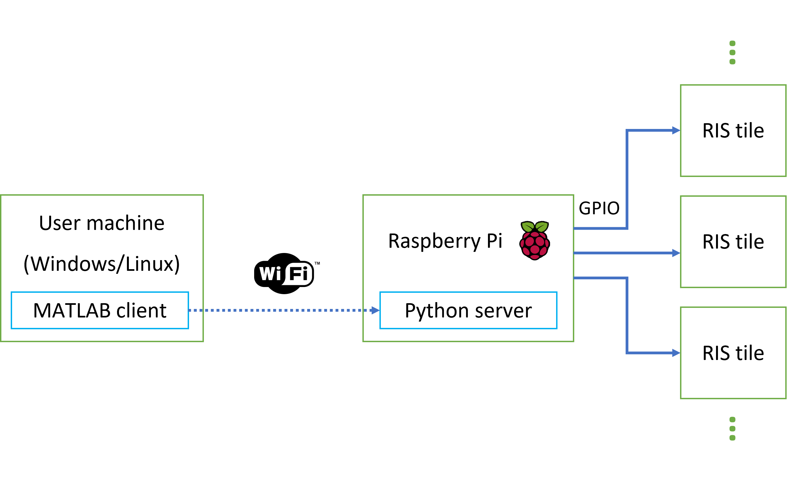

# Control

This directory contains all the information necessary to set up and interface with the RIS prototype. 

RIS configurations are sent over a WiFi link hosted on the Raspberry Pi 3B. A socket is established with MATLAB acting as the client, connecting to a server running on the Raspberry Pi. The server-side software is currently written in Python. Configurations sent via MATLAB are transformed into the correct format by the Python program on the Pi side. The Pi then sets the digital states of the GPIO pins to program the shift registers on the respective RIS tiles. 

## WiFi Access Point

By default, the access point on the USC prototype is set up on boot, with an access point name **PiRS**. The password is the default and won't be posted here for obvious reasons (just ask James or others in the project). 

To set up an access point on the Raspberry Pi 3B from a fresh install, see the guide posted [here](https://learn.sparkfun.com/tutorials/setting-up-a-raspberry-pi-3-as-an-access-point/all). Note the static IP address you use in the __interfaces__ file.

As an alternative, you may set up a mobile hotspot on a PC and get the Pi to connect to you. You will need to connect a monitor/keyboard/mouse to the Pi the first time you do this. 

## Socket Setup

The current procedure for setting up a socket for RIS control involves:

- Connect to the **PiRS** WiFi access point from the user machine
- Establish control of the Pi via SSH (i.e., via the command __ssh pi@192.168.4.1__). Use the default username and password.
- Run the program **python ~/control/socket-server-tiles.py**
- Note the port number **port_number** (this can be found in the **PORT** variable in the program)
- In MATLAB on the user machine, run the command **sock = tcpclient("192.168.4.1", port_number)** where **port_number** is an integer of the port number displayed when running the server

## MATLAB Interfacing

Configurations are sent over the socket in the form of a string of bits. Additionally, a tile number is sent so that the Pi knows which set of GPIO pins it should send the control signals over. 

## Pinout

Each RIS tile requires 6 digital inputs alongside a DC voltage and a ground connection. The DC voltage should be the same level as the logic high. For the Raspberry Pi 3B, this will be 3.3 V. 

## Pi Graphical User Interface

If for whatever reason you need to access the graphical user interface (GUI) of the Raspberry Pi, you can use a VNC viewer. One such program you is RealVNC which can be found [here](https://www.realvnc.com/en/connect/download/vnc/). Follow the first two instructions in the **Socket Setup** section above, then:

- In the secure shell, run the command **vncserver**. Note down the IP address and the number following the colon.
- Open VNC Viewer or an equivalent program. Use the VNC server address **192.168.4.1:#** where **#** is the number obtained in the previous step (typically defaults to 1 if no other session is open).
- Enter the username and password of the Pi. This is set to default.

