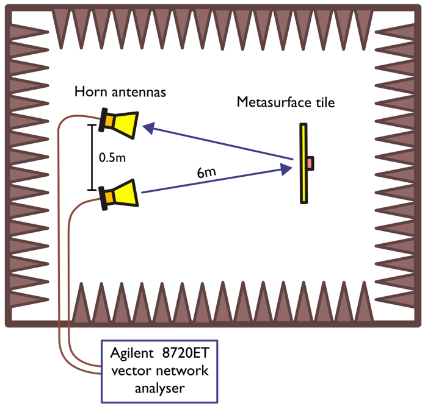
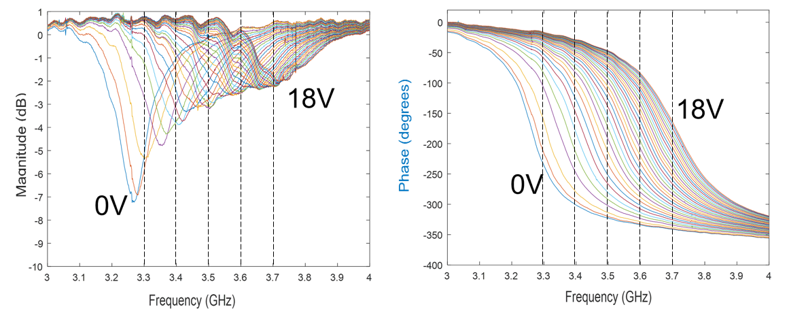

# Datasheet

This directory contains information on the device performance

## Local Reflection Coefficients

The device provides a 1-bit reflection response at both linear polarisations. This 1-bit response needs to be tuned to the centre operating frequency. 

### Reflection coefficient measurement setup

The two horn antennas, directed at the center of a single RIS tile, are positioned in the far-field of the sample. This distance should be approximately $r = 2D^2/\lambda$ where D is the lateral dimension and $\lambda$ is the shortest wavelength of interest. The antennas are spaced 0.5 m apart to avoid mutual coupling between them. The tile will reflect most of the incident power in the specular direction and this is what we exploit to ascertain the reflection coefficients. We assume that local reflection coefficients - that is, the complex coefficient determining the nature of the local electric field that is re-radiated from a given element on the surface - can be approximated by the global reflection behaviour of the surface. These reflection coefficients can be varied by changing the reverse-bias voltage of the varactor diodes in each unit cell. It is necessary to extract these values globally as it is difficult to measure the reflection response of any single unit cell.

### Calibration

In order to remove the contributions of the cables, horn antennas, and path loss from the RIS tile response in the S21 measurement, we first normalise to the reflection response of a homogenous metal plate. A copper plate is placed in contact with the tile face and the S21 is normalised. The reflection coefficients are then extracted by removing the copper plate and ascertaining the magnitude and phase responses for the reverse bias voltage levels of interest.

### Local reflection response

Magnitude and phase versus frequency

Magnitude and phase versus reverse-bias voltage

## Radiation Patterns

### Far field measurement setup

### Calibration
