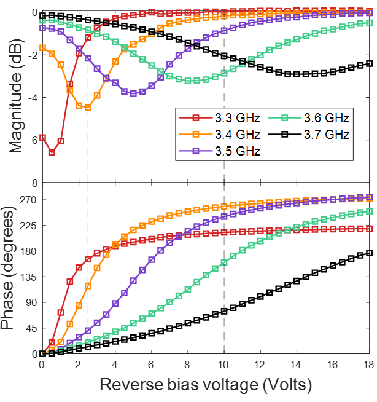
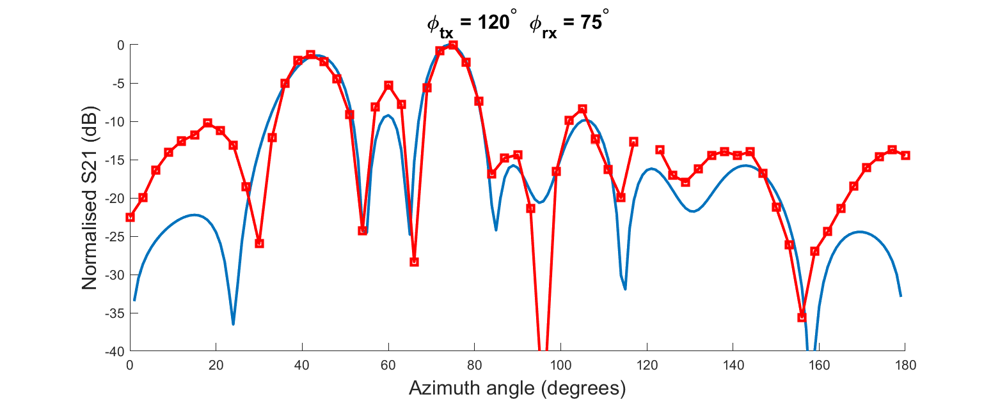
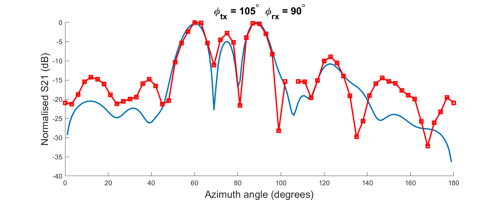
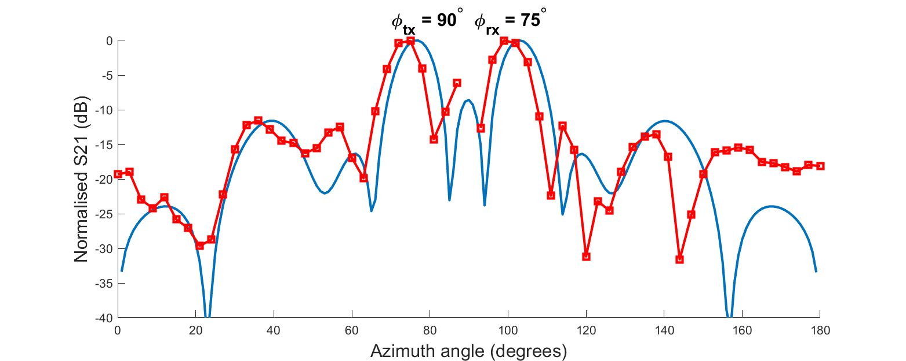

# Datasheet

This directory contains information on the device performance

## Overview of Operating Principles

A typical RIS deployment is shown in the image below. A receiver located within the user equipment (UE) is served by the base station (BS) via the reconfigurable intelligent surface (RIS), circumventing the highly-attenuated direct path between the BS and the UE.

If we consider a geometrical optics approximation, the below equation can be used to approximate the power $P_r$, received at an antenna with gain $G_r$, originating from reradiation from a RIS consisting of an arrangement of $MN$ elements. Each element is considered to have lateral dimensions $d_x$ and $d_y$ referring to the x and y axes, respectively. $\lambda$ is the wavelength at the frequency of interest. Taking the origin of the coordinate system at the center of the RIS, $r_{n,m}^t$ and $r_{n,m}^r$ are the distances between the transmitter and element (n,m) and the receiver and element (n,m), respectively. Any path between the transmitter and receiver is assumed to be neglible (thereby warranting the deployment of the RIS to mitigate this). The radiation patterns in reception and transmission are factored into the received power formulation through $F_{n,m}^{combine}$. 

$$ P_r = P_t\frac{G_tG_rd_xd_y\lambda^2}{64\pi^3}|\sum_{m=1-\frac{M}{2}}^{M/2}\sum_{n=1-\frac{N}{2}}^{N/2}\frac{\sqrt{F_{n,m}^{combine}}\ \Gamma_{n,m}}{r_{n,m}^tr_{n,m}^r}e^{(-j\frac{2\pi}{\lambda}(r_{n,m}^t+r_{n,m}^r))}|^2 $$

For a fixed RIS position, the controllability of the wireless channel is achieved through the tunability of $\Gamma_{n,m}$. For a given element geometry, $\Gamma_{n,m}$ determines the change in the phase and magnitude of an incident local electric field - this is observed on the re-radiated local electric field. As governed by the Huygen-Fresnel principle, we can craft the localised re-radiated electric field components such that they add constructively in a dominant direction, form a split beam, or any number of application-dependent forms. Elements are tuned by varying the reactance of the grid impedance associated with a given element. In the prototype in this archive, we have employed varactor diodes to provide this tunable impedance. The digital nature of the control circuitry limits us to 2 tuning states per polarisation per unit cell element. This does not pose a significant limitation on the beamforming performance of these devices.

### Examples

## Local Reflection Coefficients

To synthesise a desired RIS re-radiation response, we set the reflection coefficients $Γ_{n,m}$ associated with each unit cell. The RIS consists of many constituent elements, each of which can be tuned between 2 reflection coefficient values on each polarisation. This 2-state response is often referred to as a 1-bit response. The device provides a 1-bit reflection response at both linear polarisations. This 1-bit response needs to be tuned to the centre operating frequency. We can approximate what the local reflection coefficient for a given unit cell: 

- By placing the sample unit cell within a waveguide and measuring the S11, subject to some caveats (see [here](https://ieeexplore.ieee.org/abstract/document/5067833)), or
- By measuring the reflection response of a metasurface consisting of similar unit cell elements, each with the same bias conditions

We have opted for the second approach here since it requires no more equipment than that required for ascertaining the radiation patterns.

For information on usage of this local reflection coefficient data, skip to [here](https://github.com/jimrains/USCRIS/edit/main/datasheet/Readme.md#local-reflection-coefficients-how-to-use-this-data).

### Reflection coefficient measurement setup

The two horn antennas, directed at the center of a single RIS tile, are positioned in the far-field of the sample. This distance should be approximately $r = 2D^2/\lambda$ where D is the lateral dimension and $\lambda$ is the shortest wavelength of interest. The antennas are spaced 0.5 m apart to avoid mutual coupling between them. The tile will reflect most of the incident power in the specular direction and this is what we exploit to ascertain the reflection coefficients. We assume that local reflection coefficients - that is, the complex coefficient determining the nature of the local electric field that is re-radiated from a given element on the surface - can be approximated by the global reflection behaviour of the surface. These reflection coefficients can be varied by changing the reverse-bias voltage of the varactor diodes in each unit cell. It is necessary to extract these values globally as it is difficult to measure the reflection response of any single unit cell.

### Calibration

In order to remove the contributions of the cables, horn antennas, and path loss from S21 response in the measurements, we first normalise to the reflection response of a homogenous metal plate. A copper plate is placed in contact with the tile face and the S21 is normalised. This results in the reference case of a "perfect" reflector. The reflection coefficients are then extracted by removing the copper plate and ascertaining the magnitude and phase responses for the varactor reverse bias voltage levels of interest.

### Local reflection response

Γ magnitude and phase versus frequency

  

Γ magnitude and phase versus reverse-bias voltage

### Local reflection coefficients: how to use this data

The raw data for the local reflection responses is available in the measurements folder. 

## Radiation Patterns

For the **experiment setup** for extraction of the far-field patterns of a single tile, see [here](../measurements). Far-field to far-field radiation patterns have been extracted for 4 transmitter positions with incident angles, relative to broadside, of 0, 15, 30, and 45 degrees. Below is a representative example. The remaining curves and data can be found in the [measurements](../measurements) directory. The [numerical approximations]() are shown in blue, whilst the measured data points are displayed in red.

### Radiation patterns: how to use this data

The pattern measurements detailed here give a representative example of the beamforming capabilities of the device. 
