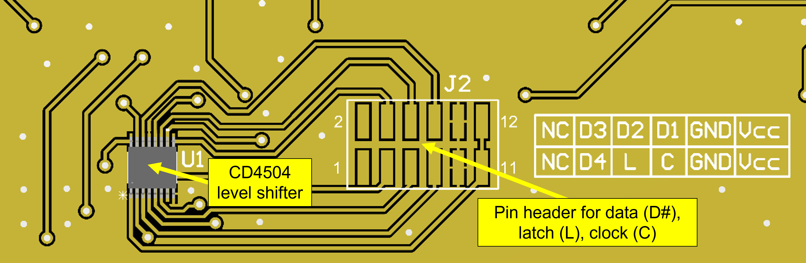

# Hardware

This directory contains information regarding the RIS digital hardware. For information regarding the design of the metasurface, see [this paper](https://github.com/jimrains/USCRIS/blob/main/publications/1_bit_DP_EuCAP_2023_Conference-5.pdf).

## Overview

## Subcircuits

### Logic level shifters

To interface with the high voltage shift registers, the digital control signals from the Raspberry Pi need to be converted to a higher voltage. The Raspberry Pi GPIO pins provide a logical low and high of 0 V and 3.3 V, respectively. The HV5308 ICs have a recommended operating voltage of 8 - 12 V. We use the CD4504 shift register ICs for this logic voltage level shifting. A logic high of 3.3 V is converted into the shift register logic voltage, V2.

The pinout for this can be found on the [datasheet](../datasheet) page and a print of the tile-side pinout can be seen in the above image.

### Power distribution

### Shift registers

## How it works

