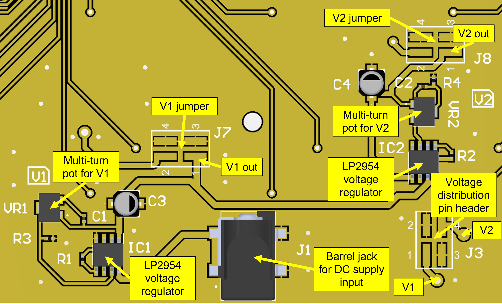

# Hardware

This directory contains information regarding the RIS digital hardware. For information regarding the design of the metasurface, see [this paper](https://github.com/jimrains/USCRIS/blob/main/publications/1_bit_DP_EuCAP_2023_Conference-5.pdf).

## Overview

The below diagram shows the digital circuit side of a RIS tile. Each tile consists of 16 high voltage shift registers, each with 32 digital outputs which can take on voltage levels of 0 and V2 volts for logic low and logic high, respectively. These shift registers are addressed by a Raspberry Pi 3B via a logic level shifter. A power distribution circuit transforms the voltage at the input jack into two manually tunable voltage levels.

## Subcircuits

### Shift registers

There are a total of 512 individually controllable varactor diodes per tile, served by a network of shift registers. The control circuitry is centred around HV5308 shift registers. These are cascaded in groups of 4. Each shift register contains 32 digital outputs with logic levels 0 and V2 volts. A single shift register supports the 2 polarisations of 16 unit cells such that they may be individually addressed.

### Level shifter

To interface with the high voltage shift registers, the digital control signals from the Raspberry Pi need to be converted to a higher voltage. The Raspberry Pi GPIO pins provide a logical low and high of 0 V and 3.3 V, respectively. The HV5308 ICs have a recommended operating voltage of 8 - 12 V. We use the CD4504 shift register ICs for this logic voltage level shifting. A logic high of 3.3 V is converted into the shift register logic voltage, V2.

The pinout for this can be found on the [datasheet](../datasheet) page and a print of the tile-side pinout can be seen in the above image.

### Power management

Voltage regulation is performed by two LN2954 ICs, providing V1 and V2. V1 is applied to the square patches of the RIS elements and V2 is used as the logic high level for the shift registers. These have been placed in series so that V2 is always greater than V1. This is to ensure that the varactor diodes are always reverse-biased.

