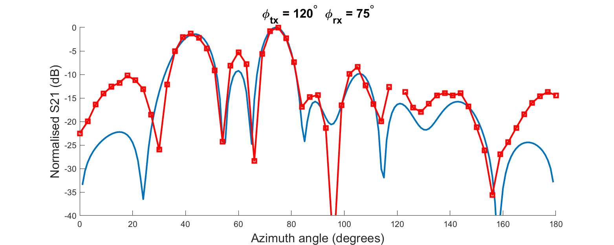

# Measurements

This directory contains information from measurements involving the RIS. For general performance, see the __datasheet__ directory.

## Far-field pattern measurements for a single RIS tile

Far-field to far-field radiation pattern measurements have been ascertained for a set of incident angles. These measurements were taken outdoors due to anechoic chamber space limitations. The setup for the measurements is depicted below. After two-port calibration of a Keysight PNA vector network analyser, the transmitter (Tx) and receiver (Rx) horn antennas were placed on a semicircle at a distance of 8.3 m from a single metasurface tile. All heights to the antenna centres were 1.5 m. The horn antennas were directed to the centre of the tile by use of a laser pointer and level. 

During each stage of the measurements, the Tx antenna remained static whilst the Rx antenna was placed at 3 degree intervals along a semicircle. At each Rx location, 11 configurations of the RIS were iterated through. This allowed us to extract 11 far-field patterns at each Rx position. These configurations were selected to maximise power in 11 different directions (15 to 165 degrees in 15 degree steps).

Below is a selection of pattern measurements for a single tile.

