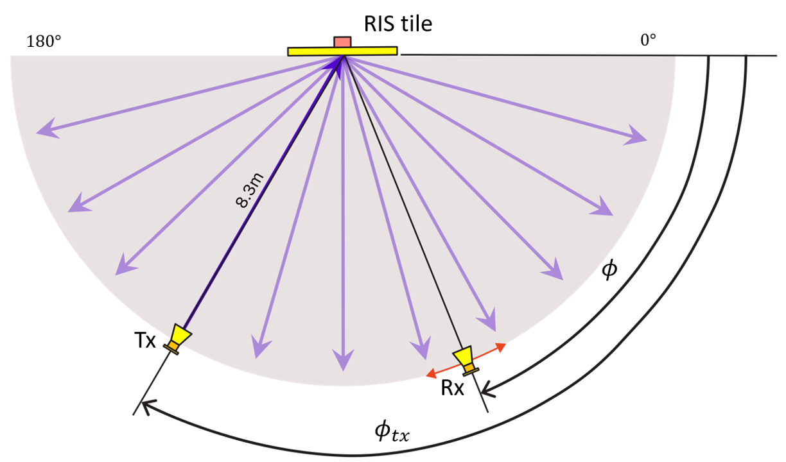
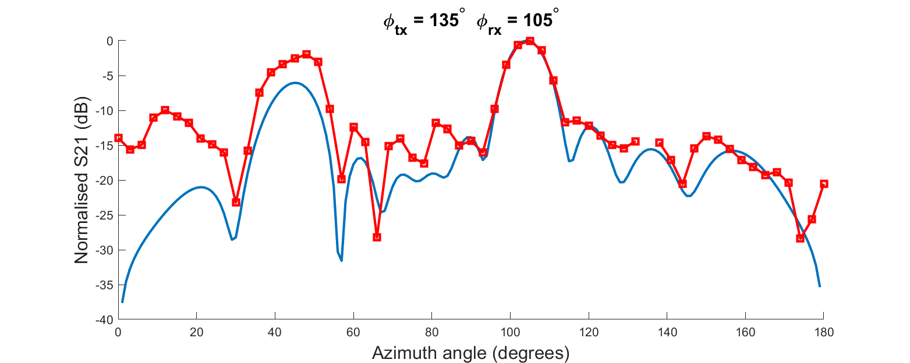
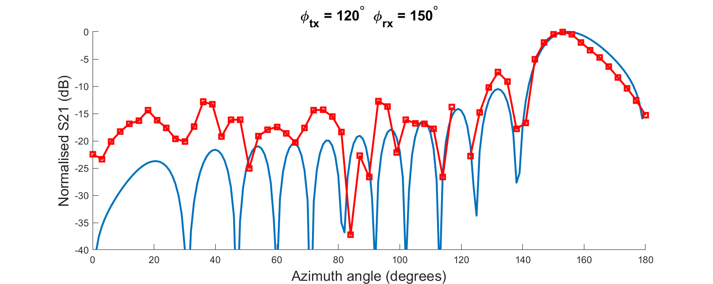
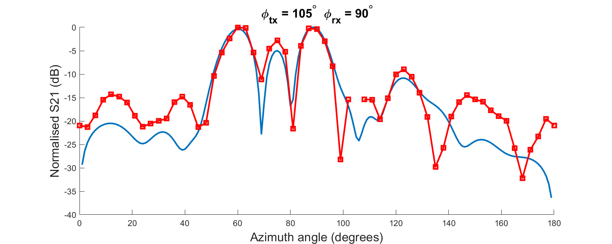
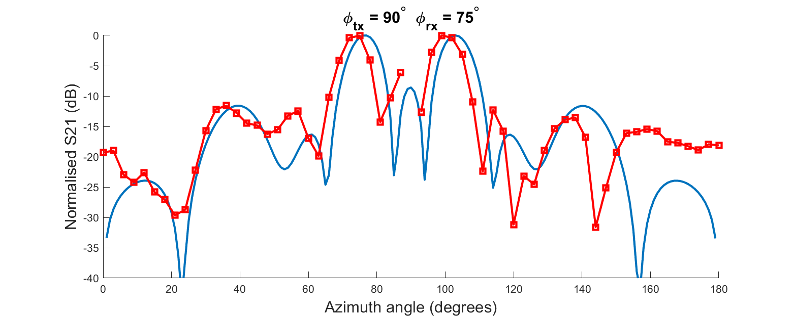
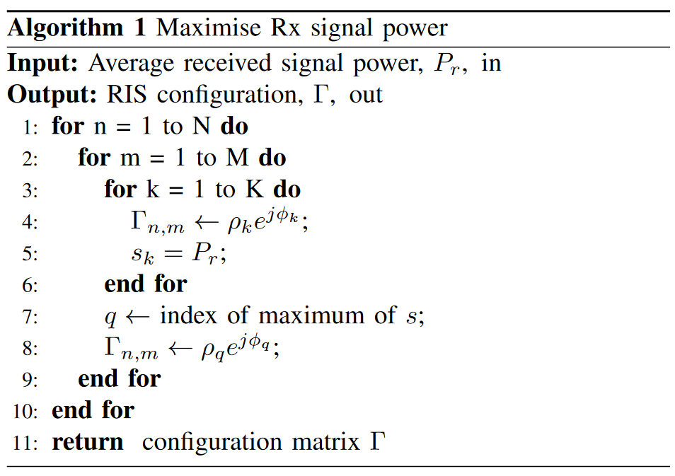
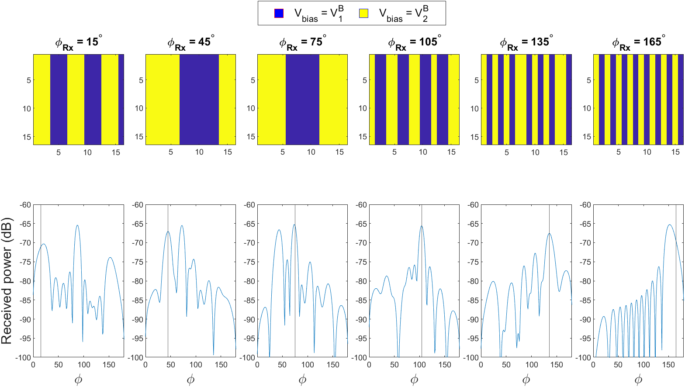
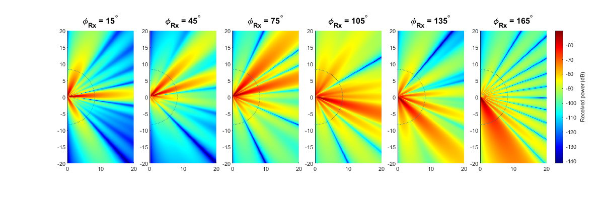

# Measurements

This directory contains information from measurements involving the RIS. For general performance, see the [datasheet](../datasheet) directory.

## Far-field pattern measurements for a single RIS tile

Far-field to far-field radiation pattern measurements have been ascertained for a set of incident angles. These measurements were taken outdoors due to anechoic chamber space limitations. The setup for the measurements is depicted below. After two-port calibration of a Keysight PNA vector network analyser, the transmitter (Tx) and receiver (Rx) horn antennas were placed on a semicircle at a distance of 8.3 m from a single metasurface tile. All heights to the antenna centres were 1.5 m. The horn antennas were directed to the centre of the tile by use of a laser pointer and level. 

During each stage of the measurements, the Tx antenna remained static whilst the Rx antenna was placed at 3 degree intervals along a semicircle. At each Rx location, 11 configurations of the RIS were iterated through. This allowed us to extract 11 far-field patterns at each Rx position. These configurations were selected to maximise power in 11 different directions (15 to 165 degrees in 15 degree steps).

Below is a selection of radiation pattern measurements for a single tile. The x-axis, $\phi$, corresponds to navigation of the circumference of the semicircle highlighted in gray in the above diagram. For the full set of measurements, see the directories [here](./ff_singletile).

## Further information on outdoor far-field measurements

### Configuration selection

The RIS configurations were selected to maximise received power at a set of angles in the azimuthal plane relative to the RIS. For each incidence angle, dependent on the Tx position, 11 configurations were tested such that azimuth angles of $15^\circ$ to $165^\circ$ in $15^\circ$ steps. These configurations were generated through a simple algorithm that relies on a geometrical optics approximation given below.

If we consider a geometrical optics approximation, the below equation can be used to approximate the power $P_r$, received at an antenna with gain $G_r$, originating from reradiation from a RIS consisting of an arrangement of $MN$ elements. Each element is considered to have lateral dimensions $d_x$ and $d_y$ referring to the x and y axes, respectively. $\lambda$ is the wavelength at the frequency of interest. Taking the origin of the coordinate system at the center of the RIS, $r_{n,m}^t$ and $r_{n,m}^r$ are the distances between the transmitter and element (n,m) and the receiver and element (n,m), respectively. Any path between the transmitter and receiver is assumed to be neglible (thereby warranting the deployment of the RIS to mitigate this). The radiation patterns in reception and transmission are factored into the received power formulation through $F_{n,m}^{combine}$. 

$$ P_r = P_t\frac{G_tG_rd_xd_y\lambda^2}{64\pi^3}|\sum_{m=1-\frac{M}{2}}^{M/2}\sum_{n=1-\frac{N}{2}}^{N/2}\frac{\sqrt{F_{n,m}^{combine}}\ \Gamma_{n,m}}{r_{n,m}^tr_{n,m}^r}e^{(-j\frac{2\pi}{\lambda}(r_{n,m}^t+r_{n,m}^r))}|^2 $$

For a fixed RIS position, the controllability of the wireless channel is achieved through the tunability of $\Gamma_{n,m}$. For a given element geometry, $\Gamma_{n,m}$ determines the change in the phase and magnitude of an incident local electric field - this is observed on the re-radiated local electric field. Details on the formulation of this received power model can be found in [this paper](https://doi.org/10.1109/TAP.2022.3149660). 

#### Example

See the program **calc_ris_pr.m** in the **ff_numerical_model** directory. By default, the below plots are generated. Configurations and associated far-field radiation patterns are shown in the first figure. These are power samples taken on a radius of 8.3 m (the same distance used in the measurements). The transmitter is located at 8.3 m at $120^\circ$. 

The second figure (below) shows received power versus position in the half-plane to the right-hand side of the RIS for 6 different RIS configurations. 

